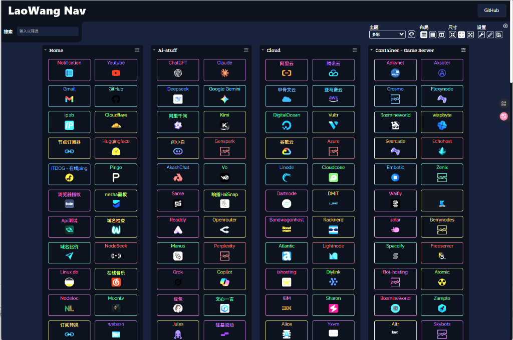
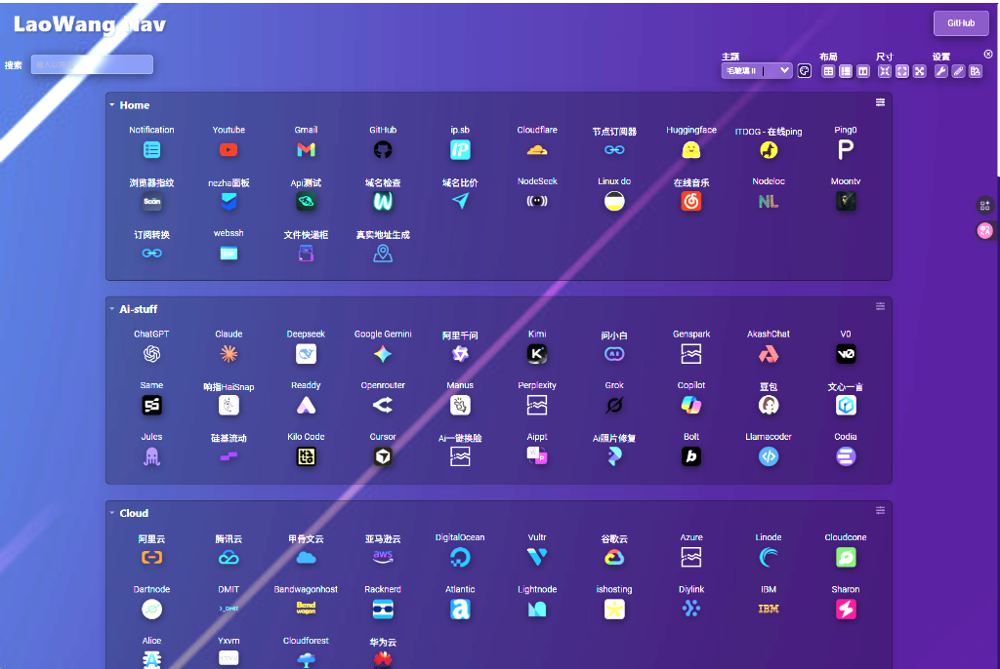
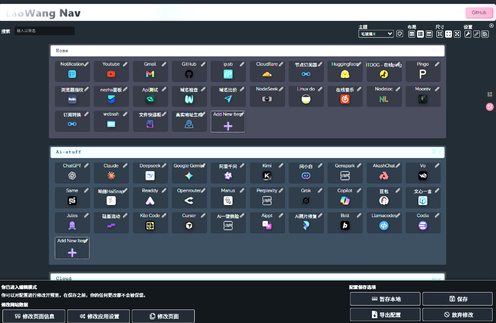
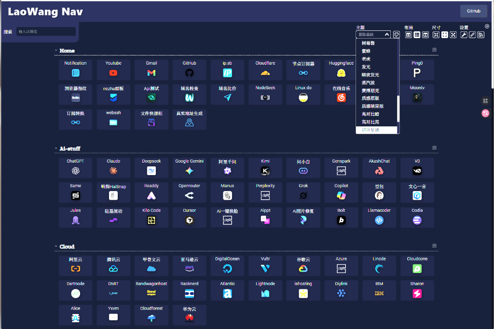

# LaoWang Nav - 您的个人导航站

> 一个现代化的个人导航网站项目。提供简洁美观的界面、强大的个性化配置和纯前端的极致体验。


## 🚀 在线演示 (Live Demo)

🎉 点击下方链接，立即体验：

[**👉 访问 LaoWang Nav 演示网站**](https://demo-nav.zeabur.app)

### 📸 效果展示

<div align="center">



*深色主题 - 多分类布局*



*紫色主题 - 优雅渐变*



*编辑模式 - 快速配置*



*主题选择器 - 15+ 精美主题*

</div>

> 💡 **提示**: 支持 15+ 款精美主题，完整响应式设计，完美适配 PC、平板、手机三端。

## 🛠️ 技术栈

**Vue + TypeScript + Vite + Node.js**

## ✨ 主要功能

### 🎨 前端体验
- **🏠 首页导航**：美观的卡片式布局，支持多层级分类
- **🔍 聚合搜索**：集成 Google、百度、Bing、GitHub 等多引擎搜索
- **📱 响应式设计**：完美适配桌面、平板和移动端设备
- **🎨 个性化主题**：内置 15+ 款精美主题（流光、星空、赛博等），支持动态背景切换
- **⛅ 实用组件**：集成实时天气、日期时间显示
- **🌍 多语言支持**：支持简体中文和 English 切换

### ⚙️ 管理与配置
- **🔒 安全认证**：支持修改管理员账号密码（本地持久化存储）
- **📝 即时编辑**：支持直接在页面上添加、编辑、删除分类和卡片
- **🖼️ 图标自动获取**：添加链接时自动抓取网站 Favicon
- **💾 配置管理**：支持配置文件的导出与导入（JSON/YAML），数据完全掌握在自己手中
- **☁️ 纯前端运行**：无需后端数据库，数据存储于本地浏览器或通过配置文件分发

## 🚀 快速部署

### ☁️ 一键部署 (推荐)

无需服务器，免费托管，点击下方按钮即可快速部署：

| 平台 | 说明 | 部署链接 |
|------|------|----------|
| **Vercel** | **推荐**，速度快，全球CDN | [](https://vercel.com/new/clone?repository-url=https://github.com/tony-wang1990/laowang-nav) |
| **Netlify** | 稳定，免费额度高 | [](https://app.netlify.com/start/deploy?repository=https://github.com/tony-wang1990/laowang-nav) |
| **Zeabur** | 容器化部署，支持国内访问 | [](https://zeabur.com/templates/XXXXX) |
| **Render** | 免费容器托管 | [](https://render.com/deploy) |
| **Cloudflare** | 边缘计算，速度极快 | [](https://deploy.workers.cloudflare.com/?repository=https://github.com/tony-wang1990/laowang-nav) |
| **Koyeb** | 全球边缘无服务器平台 | [](https://app.koyeb.com/deploy?type=git&repository=tony-wang1990/laowang-nav&branch=master&name=laowang-nav) |

### 📦 Docker 部署 (推荐VPS用户)

如果您有自己的服务器 (VPS) 或 NAS (群晖, 威联通等)，可以使用 Docker 部署。

#### 1. 使用 Docker CLI
```bash
docker run -d \
  --name laowang-nav \
  --restart always \
  -p 8080:8080 \
  ghcr.io/tony-wang1990/laowang-nav:latest
```

#### 2. 使用 Docker Compose
创建 `docker-compose.yml` 文件：
```yaml
version: '3.8'
services:
  laowang-nav:
    image: ghcr.io/tony-wang1990/laowang-nav:latest
    container_name: laowang-nav
    restart: always
    ports:
      - "8080:8080"
```
运行命令：
```bash
docker-compose up -d
```

### 💻 本地开发

```bash
# 克隆仓库
git clone https://github.com/tony-wang1990/laowang-nav.git
cd laowang-nav  

# 安装依赖
npm install

# 开发模式运行
npm run dev

# 生产构建
npm run build
```

## ⚙️ 配置说明

由于是纯前端项目，大部分配置通过界面右上角的 **设置 (Settings)** 面板进行：

1.  **默认账号**：`admin` / `admin` (请在"设置 -> 账户安全"中修改)
2.  **数据备份**：在"设置 -> 配置管理"中导出 `config.json` 进行备份
3.  **背景切换**：在"设置 -> 动态背景"中选择喜欢的主题

## 🤝 贡献指南

欢迎提交 Pull Request 或 Issue！

1.  Fork 本仓库
2.  创建特性分支 (`git checkout -b feature/AmazingFeature`)
3.  提交更改 (`git commit -m 'Add some AmazingFeature'`)
4.  推送到分支 (`git push origin feature/AmazingFeature`)
5.  打开 Pull Request

## 📄 许可证

本项目采用 MIT 许可证 - 查看 [LICENSE](LICENSE) 文件了解详情

## 👨‍💻 作者

**LaoWang** - [GitHub](https://github.com/tony-wang1990)

---

⭐ **如果这个项目对你有帮助，请给它一个星标！**
